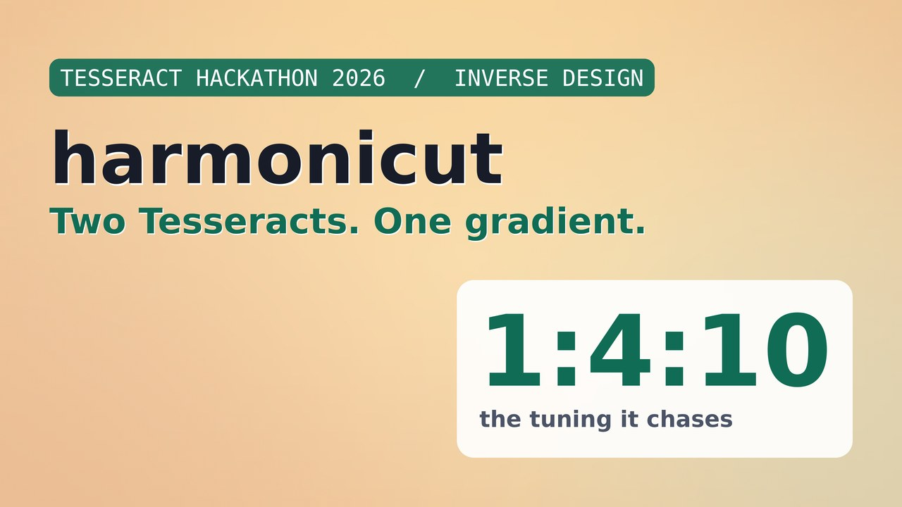
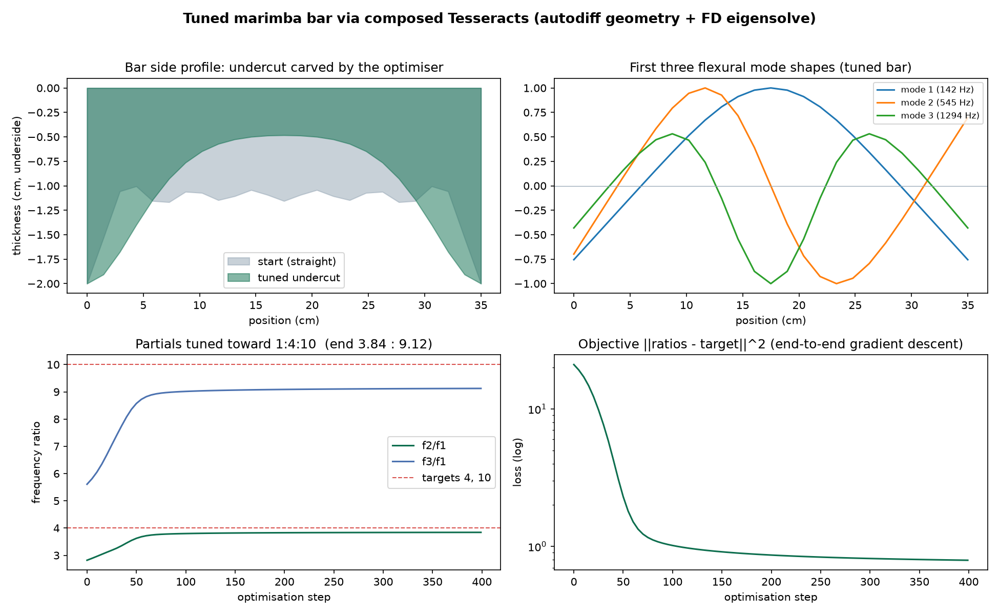

# harmonicut

**Tuning a marimba bar by composing two Tesseracts across a real boundary.**

Tesseract Hackathon 2026. Track: **Inverse design and shape optimization**. Licensed Apache-2.0.

harmonicut inverse-designs the undercut of a struck bar (marimba / xylophone) so
its first three flexural partials ring harmonic, driving toward the ideal
**1 : 4 : 10** marimba tuning. It does this by composing two Tesseracts into one
end-to-end differentiable function and running gradient descent through them.

## Demo

[](https://youtu.be/mVvXn_tomAI)

A two minute walkthrough of the composition: the end-to-end gradient matching a
global finite-difference check to about 1e-3, then the bar tuning from an untuned
2.82 : 5.61 toward the marimba ideal 1 : 4 : 10. [Watch on YouTube.](https://youtu.be/mVvXn_tomAI)



## The problem

A uniform struck bar is inharmonic. Free-free Euler-Bernoulli theory puts its
overtones at **1 : 2.76 : 5.40**, which sounds clangy, not musical. For centuries
instrument makers have fixed this by carving an undercut into the underside of
the bar, pulling the overtones onto musical ratios. Marimba bars target roughly
**1 : 4 : 10** (the fundamental, two octaves and a little beyond).

Finding that undercut is an inverse-design problem: choose the thickness profile
h(x) so the bar's eigenfrequencies land on the target ratios. Do it by hand and
it is craft and trial and error. Do it with gradients and it is a few hundred
steps.

## Why this is a Tesseract problem (the real boundary)

The forward map is: design parameters -> a smooth thickness profile -> assemble
finite-element mass and stiffness matrices -> a **generalized eigensolve** ->
the first flexural frequencies.

That eigensolve is a black box for automatic differentiation. `scipy.linalg.eigh`
is a compiled LAPACK call JAX cannot trace. Eigenvalue and eigenvector
derivatives are ill-conditioned or undefined near modal crossings, which happen
exactly where an optimiser wants to push. So the pipeline straddles a genuine
**differentiation-strategy boundary**:

- the **geometry** side (parameters -> profile) is smooth and is differentiated
  analytically by JAX,
- the **physics** side (profile -> frequencies) is a numerical black box and is
  differentiated by finite differences.

Tesseract is what makes the two sides compose. Each becomes a self-contained
component that exposes the same jacobian / jvp / vjp contract over a standard
interface. `tesseract-jax` stitches the analytic jacobian of one to the
finite-difference jacobian of the other into a single end-to-end gradient.
Neither side can produce that gradient alone: JAX cannot reach through the
eigensolve, while the finite-difference solver has no idea how the profile depends
on the design parameters. Tesseract is load-bearing here, not a costume.
## Architecture

Two Tesseracts, composed by `tesseract-jax`:

- **`geometry/`** (JAX). Maps a handful of symmetric coefficients to a smooth,
  positive undercut profile that keeps full thickness at the struck ends.
  Differentiated analytically by JAX, so it exposes exact `jacobian`, `jvp` and
  `vjp` endpoints.
- **`beam_eigen/`** (numpy + scipy). Assembles Hermite finite-element mass and
  stiffness matrices for a free-free Euler-Bernoulli bar of variable thickness
  and solves the generalized eigenproblem for the first flexural frequencies.
  The eigensolve is the black box, so it reports a **finite-difference**
  `jacobian`, `jvp` and `vjp`, plus an `abstract_eval` for shape inference.

`scripts/optimize.py` wires them with `tesseract_jax.apply_tesseract`:
`coeffs -> geometry -> profile -> beam_eigen -> frequencies -> loss`, then takes
`jax.grad` of the loss straight through both containers.

## Gradients doing real work

The end-to-end gradient from `jax.grad` (which travels through both Tesseracts,
using the analytic jacobian on one side and the finite-difference jacobian on
the other) matches a global finite-difference check of the entire pipeline to a
maximum relative error of about **1e-3**. That is the proof the gradient crosses
the boundary correctly, not a coincidence of one component.

Driven by that gradient, the objective `||ratios - (4, 10)||^2` falls from
**21.0 to 0.79** in 400 steps, while the partials move from an untuned
**2.82 : 5.61** to **3.84 : 9.12**. The undercut the optimiser carves is deep in
the middle and full at the ends, which is exactly the shape instrument makers
cut by hand: an independent sanity check that the gradients point the right way.

Honest note on the residual: **3.84 : 9.12** is close to the achievable frontier
for a single symmetric undercut bounded at a 4 mm minimum thickness. A deeper cut
or an asymmetric profile would close the last of the gap. The result that matters
is the composed gradient across the boundary, not the final decimal.

## Reproduce

Requires Docker and Python 3.11+.

```bash
pip install "tesseract-core[runtime]" tesseract-jax "jax[cpu]" scipy optax matplotlib equinox
tesseract build geometry
tesseract build beam_eigen
python scripts/optimize.py     # gradient-boundary check, then the inverse design
python scripts/visualize.py    # artifacts/summary.png and artifacts/morph.gif
```

## Layout

```
geometry/      JAX Tesseract: coeffs -> smooth symmetric undercut (analytic jvp/vjp)
beam_eigen/    numpy + scipy Tesseract: profile -> flexural frequencies (black-box eigensolve, FD jacobian)
scripts/       optimize.py (compose + verify + design), visualize.py (figure + animation)
artifacts/     history.json, summary.png, morph.gif
```

## Attribution and disclosure

Built on [tesseract-core](https://github.com/pasteurlabs/tesseract-core) and
[tesseract-jax](https://github.com/pasteurlabs/tesseract-jax) (Pasteur Labs),
with JAX, scipy, optax and matplotlib. All original work created during the
Tesseract Hackathon 2026 period, licensed Apache-2.0.

AI assistance was used in writing the code and this document. The design, the
physics, the review and the verification are the author's.

